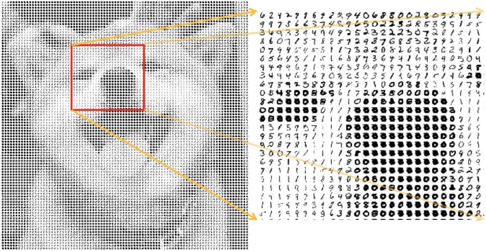
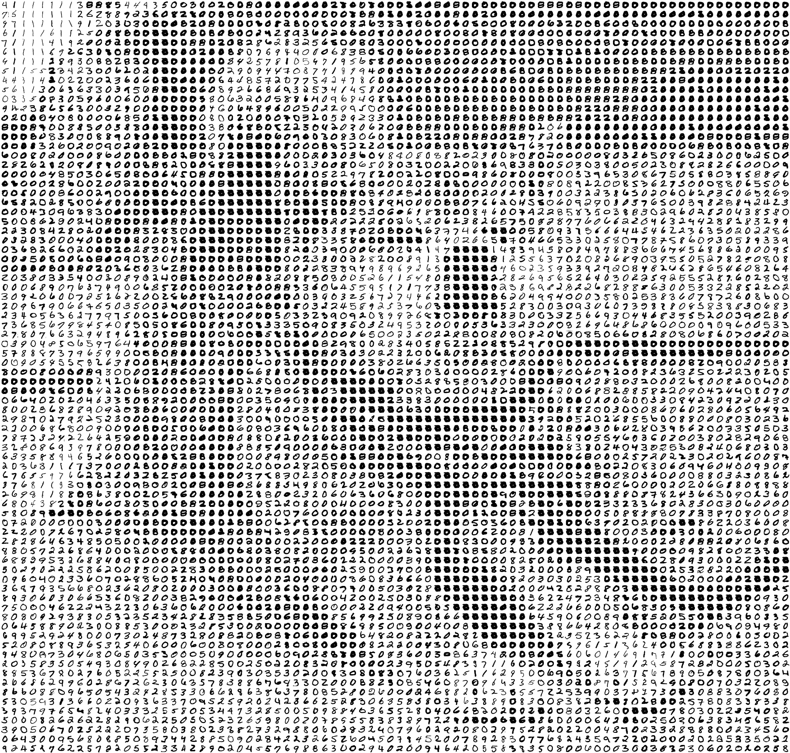

# < 2019.11.08 Image_Mosaic >

## MNIST 숫자 이미지로 시바견 그리기!

MNIST 숫자 이미지를 이용해서 이미지 픽셀을 채워볼 것 이다.

시바견의 얼굴을 MNIST 숫자로 채워보면 다음과 같은 결과 나온다.

<원본 이미지>

<MNIST 숫자 이미지로 그린 시바견>

<원본 이미지2>

<MNIST 숫자 이미지로 그린 시바견2>

